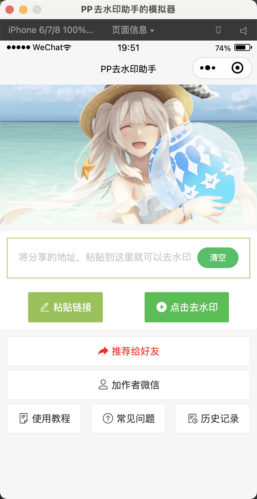
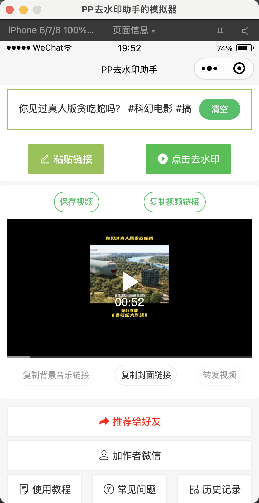

# 去水印小程序

[【腾讯云】云产品限时秒杀，爆款1核2G云服务器，首年74元](https://curl.qcloud.com/bGOkrtIr)

## 介绍

一款短视频去水印，去水印小工具，短视频无水印，短视频去水印，免费去水印，提取无水印视频，支持抖音，火山，西瓜视频视频等主流短视频平台。

## 部署方式

1. 申请小程序账号
2. 开通小程序云开发
3. 在 ``project.config.json`` 文件中修改 ``appid`` 和 ``projectname``
4. 在数据库中创建数据表
    ```
    1. p_fileid - 存储上传的视频文件 id，用于定时器清理过期文件
    2. p_view_ad_record - 存储观看激励视频的记录
    ```
5. 将云函数部署到云端（备注：remove_watermark_v3 是最新版本，可以只部署当前版本）
6. 将使用教程里面的图片上传到云存储并替换链接
7. 将分享 Logo 图片上传到云存储并替换链接
8. 配置云函数 ``remove_watermark_v3`` 的环境变量，下面是环境变量注释：

    ```
    TZ: 时区
    appid: 去水印服务的 appid
    appsecret: 去水印服务的 appsecret
    ding_at_mobile: 钉钉机器人推送消息提醒的手机号
    ding_token: 钉钉机器人 token(相关文档参考下面的备注信息)
    ```
9. 新增定时器云函数(cleanFileTimer)，函数部署完成后需要上传触发器操作，想要了解更多定时触发器的信息，点击[定时触发器文档](https://developers.weixin.qq.com/miniprogram/dev/wxcloud/guide/functions/triggers.html)

## 备注

0. 项目使用了小程序[云开发](https://developers.weixin.qq.com/miniprogram/dev/wxcloud/basis/getting-started.html)，不用购买服务器即可部署运行；
1. 组件库使用了 [vant](https://vant-contrib.gitee.io/vant-weapp/#/home)。
2. 去水印接口 [小爱网络](http://api.xiuliw.com/?ref=305)
3. 去水印接口(备用) [feeprint](https://admin.feeprint.com/?ref=47181)
4. 钉钉机器人接入文档 [自定义机器人接入](https://developers.dingtalk.com/document/robots/custom-robot-access#topic-2026027)

## 联系作者

如果需要帮助的话请联系作者，作者微信号：``dafish1212``


## 体验

微信搜索小程序 ``PP去水印助手``

或者扫码体验


## 小程序截图




## 参考文档

- [云开发文档](https://developers.weixin.qq.com/miniprogram/dev/wxcloud/basis/getting-started.html)
- [视频解析接口](https://admin.feeprint.com/?ref=47181)


